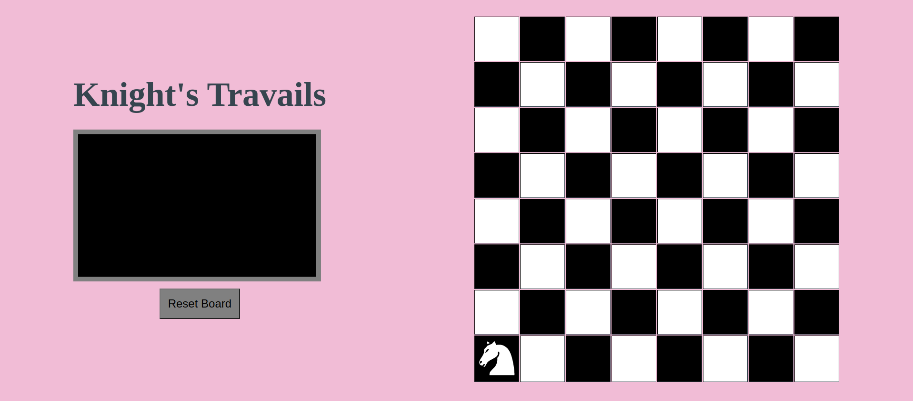
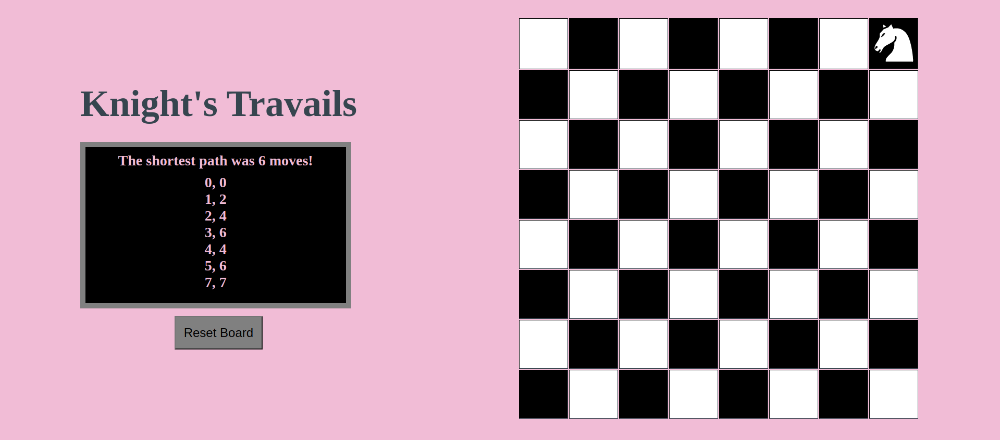

# Knights-Travails

The objective of this project is to create a chess board with a knight and move the knight around the board using JavaScript. I also used HTML, CSS, JSON, webpack, eslint and prettier on this project.

**Project Image**

Image before knight is moved:

Image after knight is moved:

**Features**

1. The UI has a chess board, knight piece, title, box for move count and move list, and a reset board button.

2. The knight piece can be moved anywhere on the board. Once moved, the shortest move count to the location and the list of moves the knight took are shown in the display box under the title.

3. The reset board button moves the knight piece back to the original start position.

